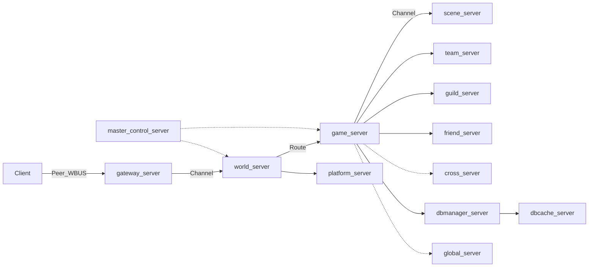
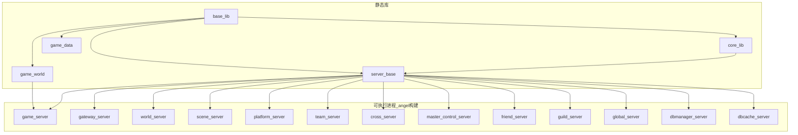
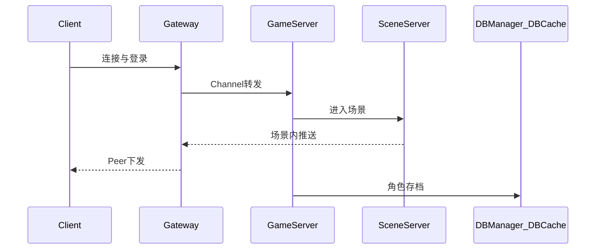

# Angel

> 分布式 MMO 服务端骨架：多进程拆分、内部总线通信、按区服水平扩展。

Angel 是一套面向大型多人在线游戏的 C++ 服务端架构雏形，覆盖客户端接入、逻辑服、场景服、数据缓存与持久化等典型分层。当前仓库以**架构与基础库**为主，多数业务进程仍为占位实现，适合作为 MMO 服务端演进的起点。

## 架构亮点

- **多进程拆分**：Gateway / GameServer / SceneServer / DB 分层，逻辑与 IO 解耦，便于按区服扩容。
- **WBUS 内部总线**：服间走 Channel，客户端经 Gateway 走 Peer，地址编码为 `area.zone.type.index`。
- **全局唯一对象 ID**：64 位 ID 嵌入时间、GS 索引、序号、区服与类型，支持多 GS 水平扩展。
- **Protobuf 协议管线**：CMake 已接入 `protoc` 预处理，协议目录约定已预留（文件待补）。
- **DBCache 分层**：`USE_DBCACHE` 已开启，设计为 GameServer 经 DBManager 访问 DBCache，再落库。
- **寻路与坐标预留**：集成 RecastNavigation 第三方库，坐标 Agent / 地形 Agent 类骨架已声明。
- **优雅停服**：`GAME_SERVER_STATE_TYPE` 定义多阶段停服状态机（清消息、存角色、踢人等）。
- **配置热更**：`LoadCfgByConfigParam` 支持多类配置项与可选 reload 线程。

## 进程与服务角色

## 与 MMORPG 架构文章对照

本文档参考了 [游戏思考13：大型 MMORPG 游戏服务器分类及作用](https://blog.csdn.net/weixin_43679037/article/details/124957453) 中对大型 MMORPG 后端的分层方式，并按 Angel 当前代码做了映射：

- **Gateway / LoginGate**：对应 `svrGW` 与 `gateway_server`，负责客户端连接、会话、消息转发，是客户端进入内网服务的唯一入口。
- **GameCenter / 大厅服**：对应 `svrWS` 与 `world_server`。按 Angel 风格命名为 WorldServer，后续可承载选角、非场景业务、GS 路由与世界级协调。
- **GameServer**：对应 `svrGS` 与 `game_server`，负责角色玩法逻辑、对象 ID、与 SceneServer / DB 层协作。
- **SceneServer**：对应 `svrSS` 与 `scene_server`，负责地图实例、实体位置、移动片段、AOI 与场景内广播。
- **DBManager / DBCache**：对应 `dbmanager_server` 与 `dbcache_server`，保持 DB 代理 + 缓存层分离。
- **状态同步取向**：MMORPG 优先采用服务器权威的状态同步；移动可用 `MovementFragment` 这类移动片段降低每帧同步带宽。

| 缩写 | 枚举 | 设计职责 | 可执行进程 | 实现状态 |
|------|------|----------|------------|----------|
| GW | `svrGW` | 客户端接入、会话、转发 C2S/S2C | `gateway_server` | 框架可运行，业务待实现 |
| GS | `svrGS` | 核心玩法逻辑、对象管理、协调各服 | `game_server` | 框架可运行，已接 `CGameWorld` 主循环 |
| WS | `svrWS` | 世界/大区协调（GameCenter / 大厅服） | `world_server` | 框架可运行，业务待实现 |
| SS | `svrSS` | 场景实例、副本、AOI 等 | `scene_server` | 框架可运行，AOI/移动同步待实现 |
| PS | `svrPS` | 平台/支付类服务 | `platform_server` | 框架可运行，业务待实现 |
| TS | `svrTS` | 组队/匹配类服务 | `team_server` | 框架可运行，业务待实现 |
| CS | `svrCS` | 跨服玩法 | `cross_server` | 框架可运行，业务待实现 |
| MCS | `svrMCS` | 主控/协调类服务 | `master_control_server` | 框架可运行，业务待实现 |
| FS | `svrFS` | 好友/社交 | `friend_server` | 框架可运行，业务待实现 |
| Guild | `svrGuild` | 公会系统 | `guild_server` | 框架可运行，业务待实现 |
| Global | `svrGlobal` | 全服唯一数据 | `global_server` | 框架可运行，业务待实现 |
| — | — | DB 路由与持久化编排 | `dbmanager_server` | 框架可运行，持久化待实现 |
| — | — | 角色/数据缓存层 | `dbcache_server` | 框架可运行，缓存逻辑待实现 |

> 仅当 CMake **构建目录名为 `angel`** 时，才会编译上表中的业务进程（见 [Server/build/CMakeLists.txt](Server/build/CMakeLists.txt)）。

## 架构拓扑



**库与进程依赖（静态库 → 可执行文件）：**



## 消息与数据流

### 典型玩家路径（设计目标）

1. **登录**：Client → Gateway（Peer）鉴权与会话建立 → Channel 转发至 GameServer。
2. **进场景**：GameServer 分配/选择 SceneServer → 创建或挂载场景对象，下发可见集（AOI）。
3. **切场景**：GameServer 协调源/目标 SceneServer，迁移对象状态并更新 Gateway 路由。
4. **存档**：GameServer 经 DBManager 写入 DBCache，再异步或同步落持久化存储。



### WBUS 通信模型

- **地址**：`wbus_addr(area, zone, type, index)`，字符串形式如 `area.zone.type.index`（见 `server_def.h` / `wbus_def.h`）。
- **Channel**：服务器之间的可靠消息通道（`channel_send` / `channel_sendv`）。
- **Peer**：客户端与 Gateway 之间的连接（`peer_send`，代码注释 `peer -- gateway`）。

### 配置热更

进程可通过 `LoadCfgByConfigParam` 加载多类配置，主要类型包括：

| 类型 | 说明 |
|------|------|
| `CONFIG_TYPE_MAIN` | 进程主配置 |
| `CONFIG_TYPE_WHITELIST` | GameServer 白名单 |
| `CONFIG_TYPE_TESTACNT` | 测试账号 |
| `CONFIG_TYPE_MSGFREQLIST` | 消息频率限制 |
| `CONFIG_TYPE_SSMSGFREQLIST` | SceneServer 消息频率限制 |
| `CONFIG_TYPE_DBOPFREQLIST` | DB 操作频率限制 |
| `CONFIG_TYPE_GAMETOOS` | 运维工具配置 |
| `CONFIG_TYPE_CLIENTRESFOLDERS` | 需下发给客户端的资源目录 |
| `CONFIG_TYPE_LOCAL_RELAY_TESTACNT` | 本地服白名单 |

`CGameServer::CreateReloadThread` 预留了配置热更线程入口（实现待补）。

### 对象 ID 与类型

对象 ID 为 64 位紧凑编码（`OBJECT_ID`）：时间戳 + GS 索引 + 序号 + 区 + 类型。  
`CGameWorld::generate_obj_id` 已在 GameServer 侧实现生成逻辑。

支持的对象类型（`OBJECT_TYPE`）：Role、Npc、Doodad、Missile、Build、SceneItem、Volume。

## 目录结构

```
Angel/
├── README.md           # 本文件：架构总览
├── Server/             # C++ 服务端主体
│   ├── build/          # CMake 工程（构建目录须命名为 angel）
│   ├── inc/            # 头文件（按模块分目录）
│   ├── src/            # 源码
│   │   ├── base_lib/       # WBUS、网络、队列、定时器、共享内存
│   │   ├── core_lib/
│   │   ├── game_data/
│   │   ├── game_world/     # 游戏世界、坐标、对象 ID
│   │   ├── server_base/    # 应用框架、日志、配置
│   │   ├── gateway_server/
│   │   ├── world_server/
│   │   ├── game_server/
│   │   ├── scene_server/
│   │   ├── platform_server/
│   │   ├── team_server/
│   │   ├── cross_server/
│   │   ├── master_control_server/
│   │   ├── friend_server/
│   │   ├── guild_server/
│   │   ├── global_server/
│   │   ├── dbmanager_server/
│   │   ├── dbcache_server/
│   │   └── misc/
│   ├── lib/            # 编译产物（静态库）
│   ├── bin/            # 可执行文件输出目录
│   └── 3rd/            # 第三方：protobuf、RecastNavigation、zlib 等
├── Shared/             # 跨端共享协议（proto，目录已预留，文件待补）
├── Excel/              # 策划表工具链（规划中）
└── Tool/               # 辅助工具（规划中）
```

## 构建

**前置条件**

- Windows：Visual Studio（CMake 生成 MSVC 工程）
- Linux：GCC 4.8+，C++11
- 构建目录名必须为 **`angel`**，否则不会编译业务进程

**Windows（示例）**

```powershell
cd Server
mkdir build\angel
cd build\angel
cmake ..\..\build -DCMAKE_BUILD_TYPE=Release
cmake --build . --config Release
```

**Linux（示例）**

```bash
cd Server
mkdir -p build/angel && cd build/angel
cmake ../../build -DCMAKE_BUILD_TYPE=Release
make -j$(nproc)
```

**产物路径**

- 可执行文件：`Server/bin/<进程名>/`（Debug 带 `_d` 后缀）
- 静态库：`Server/lib/`

**协议代码生成**

CMake 在配置阶段会调用 `protoc` 处理以下路径（若目录为空或缺少 `.proto` 会导致配置失败）：

- `Shared/proto`
- `Server/src/game_data/proto`
- `Server/src/game_world/proto`

## 配置与协议（规划）

当前仓库**尚未包含**具体配置文件样例；以下为代码中已约定的扩展点，实施时需自行补齐：

- 各进程主配置：对应 `CONFIG_TYPE_MAIN`，由 `ProcConfNode` 描述路径与 metalib 绑定。
- 协议定义：建议客户端与服务器共用 `Shared/proto`，服内模块协议放在 `game_data/proto`、`game_world/proto`。
- 日志、区服 ID、WBUS 路由表：预期在进程主配置与 `CSsGameApp` 初始化流程中加载（`ss_game_app` 框架已声明接口）。

## 当前进度与路线图

**已完成 / 有实质代码**

- `base_lib`：WBUS 地址与网络层、环形缓冲、异步消息队列、定时器、共享内存
- `game_world`：游戏世界单例、`generate_obj_id`
- `game_server`：`CGameServer` 单例与 `CFramServer` 停服钩子
- `define`：服务器类型、停服状态机、配置类型、行为树节点枚举
- CMake 工程与 `protoc` 预处理管线
- RecastNavigation 第三方源码 vendoring

**进行中 / 骨架**

- `gateway_server`、`world_server`、`game_server`、`scene_server`：已接入统一 `CSsGameServerApp` 主循环，业务逻辑待实现
- `platform_server`、`team_server`、`cross_server`、`master_control_server`、`friend_server`、`guild_server`、`global_server`：已建立 Angel 风格进程骨架
- `dbmanager_server`、`dbcache_server`：已接入统一 `CSsGameServerApp` 主循环，持久化与缓存逻辑待实现
- `misc`：`main` 仍为占位
- `coordinate_*`、`WkCoordAgent`：类声明，无业务逻辑
- `CSsGameApp`：已补最小 runtime 桥接，完整 TAPP 行为仍待扩展
- `Excel/`、`Tool/`：空目录

**待做**

- 补齐完整 `.proto` 与 C/S 消息分发
- 实现 Gateway 会话与 GS 路由
- SceneServer AOI 与场景对象同步
- DBManager / DBCache 读写路径与 `USE_DBCACHE` 闭环
- 配置样例、起服脚本与本地联调环境
- World / Platform / Team / Cross / Guild / Global 等进程的业务逻辑

## 常见问题

- **CMake 配置失败，提示 proto 相关错误**  
  需先在 `Shared/proto`、`Server/src/game_data/proto`、`Server/src/game_world/proto` 中放置至少一个有效的 `.proto` 文件，或暂时调整 `Server/build/CMakeLists.txt` 中的 `preprocess_proto` 调用（开发阶段）。

- **编译成功但没有 `game_server` 等可执行文件**  
  确认构建目录名为 `angel`（`FOLDER_NAME STREQUAL "angel"` 才会 `add_subdirectory` 业务进程）。

- **进程启动后没有业务响应**  
  当前进程已接入 `CSsGameApp` 主循环，但登录、场景、DB 等业务仍是骨架，需要继续补消息分发和数据流程。

- **对象 ID 生成失败**  
  需确认 `CGameWorld::init` 已在 `game_server` 启动时执行；对象类型必须位于 `otRole` 到 `otTotal` 范围内。

- **和 OpenVideoScribe 的关系**  
  无代码依赖；本 README 仅参考 [scribe-web/README.md](../scribe-web/README.md) 的文档结构与语气。
