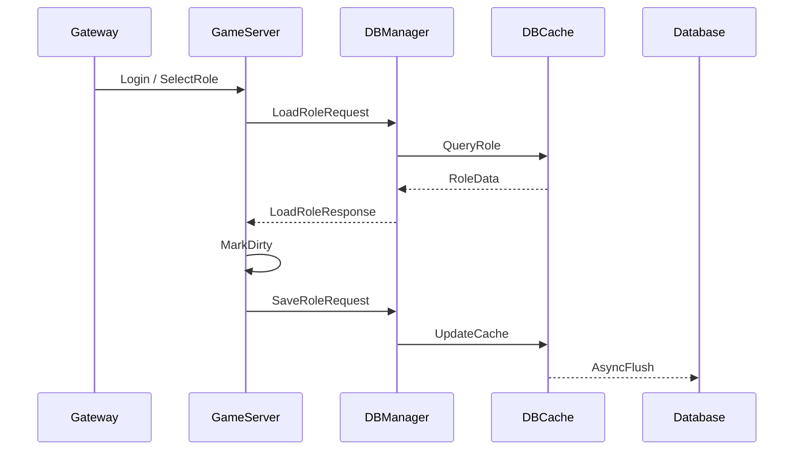

# Angel 角色数据闭环设计

## 当前状态

本模块为 Angel 补了角色数据闭环的第一层骨架：

- `CRoleData`：角色基础数据结构。
- `CRoleDataCache`：内存缓存，支持加载/创建、查找、标脏、flush 脏数据。
- `GameServer`：初始化角色缓存，停服到 `gsstStopWaitForSaveRole` 阶段时 flush 脏角色。
- `DBCacheServer`：持有角色缓存，退出时 flush 脏数据。
- `game_data.proto`：新增 `RoleData`、`LoadRoleRequest/Response`、`SaveRoleRequest/Response`。

## 数据流目标

## 后续工作

1. 补 GameServer 到 DBManager 的内部消息。
2. 补 DBManager 到 DBCache 的缓存查询/更新消息。
3. 补 DBCache 到实际数据库的持久化适配。
4. 增加脏数据定时 flush、批量落库、失败重试。
5. 将 `CRoleData` 迁入共享内存对象注册表，获得热重启恢复能力。
