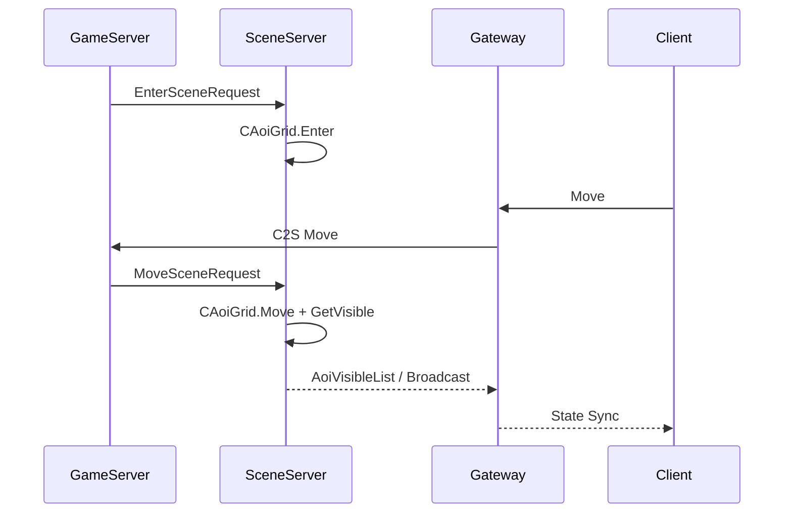

# Angel 场景与 AOI 设计

## 当前状态

本模块为 Angel 增加了 Scene/AOI 的第一层可编译骨架：

- `CAoiGrid`：九宫格 AOI 管理器，支持对象进入、移动、离开和可见列表查询。
- `CGameWorld`：持有 AOI 网格，并提供 `enter_world_object`、`update_object_movement`、`leave_world_object`、`get_visible_objects`。
- `SceneServer`：初始化独立 AOI 网格，为后续场景内状态同步做准备。
- `scene.proto`：新增进入场景、移动、离开、可见列表协议结构。

## 数据流目标

## 后续工作

1. 将 Gateway 收到的客户端移动消息转发到 GameServer。
2. GameServer 校验移动并转发 `MoveSceneRequest` 到 SceneServer。
3. SceneServer 基于 `CAoiGrid` 计算进入/离开视野集合。
4. 补场景实例、地图 ID、副本 ID、对象类型和广播过滤。
5. 将场景对象迁入共享内存对象注册表，实现热重启恢复。
