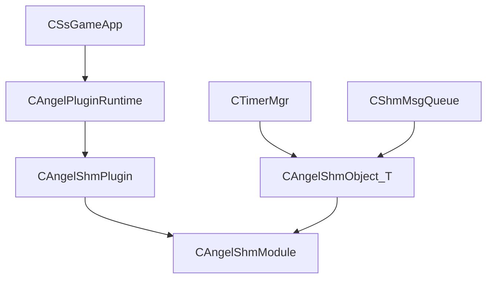

# Angel 共享内存插件设计

## 定位

Angel 原有共享内存代码集中在 `base_lib/shm.h`、`base_lib/shm_object.h` 和 `src/base_lib/vm/shm.cpp`，更像早期封装，且 `CShmObject<T>::create_data()` / `restore_data()` 尚未完成。本次迁移改为 NFShmXFrame 风格：共享内存能力由插件生命周期驱动，对象创建/恢复由统一模块管理。

## 新结构



## 关键文件

| 文件 | 作用 |
|------|------|
| `Server/inc/base_lib/nf_shm/angel_plugin_runtime.h` | 插件生命周期运行时 |
| `Server/inc/base_lib/nf_shm/angel_shm_module.h` | 共享内存段管理、创建/恢复模式 |
| `Server/inc/base_lib/nf_shm/angel_shm_registry.h` | 共享内存对象类型注册表 |
| `Server/inc/base_lib/nf_shm/angel_shm_object.h` | 模板对象包装，替代旧 `CShmObject<T>` 实现 |
| `Server/inc/base_lib/shm_object.h` | 兼容入口，转发到新实现 |

## 与 NFShmXFrame 的对应关系

| NFShmXFrame | Angel 当前落点 |
|-------------|----------------|
| `NFIPluginManager` / `NFCPluginManager` | `CAngelPluginRuntime` |
| `NFShmPlugin` | `CAngelShmPlugin` |
| `NFCSharedMem` | `CAngelShmModule` 的段管理 |
| `NFObject` / `NFObjectTemplate` / `NFShmObjSeg` | 后续业务对象迁移目标 |

当前版本先迁移基础生命周期和共享内存段管理；业务对象完整迁入 `NFObject` 模型需要后续为每类对象分配稳定类型 ID、恢复回调和版本校验。

## 对象注册表

`CAngelShmRegistry` 是后续业务对象迁入对象段系统的入口。每类共享内存对象应注册：

- 稳定 `typeId`：不能依赖编译器生成名，正式业务对象需要手工分配。
- `className`：用于诊断、日志和检查工具展示。
- `objectSize` / `itemCount`：用于计算对象段容量。
- `useHash` / `singleton`：描述索引策略和单例对象。
- `createFn` / `resumeFn` / `destroyFn`：用于创建、恢复和销毁对象。

示例：

```cpp
AngelRegisterShmObject<CRole>(10001, "CRole", 10000, TRUE, FALSE);
```

兼容层 `CShmObject<T>` 仍可工作，但它只适合 Timer / Queue 这类旧模块过渡使用。正式 MMO 对象应显式注册稳定 `typeId`，避免热重启时类型漂移。

## 后续工作

- 为角色、场景对象、定时器、事务对象定义稳定类型 ID，并接入 `CAngelShmRegistry`。
- 补共享内存版本号、布局校验和恢复失败保护。
- 增加共享内存检查工具：查看对象数、空闲数、脏数据和可安全销毁标记。
- 将 Timer / Queue 从兼容模板进一步迁移为对象段管理。
